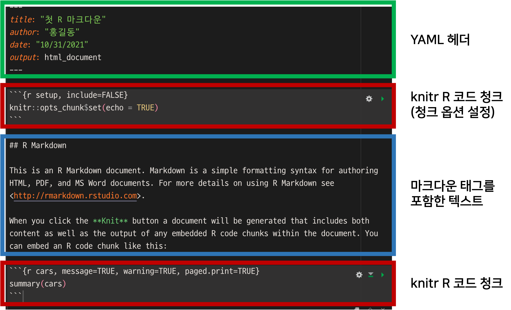

```{r setup, include=FALSE}
knitr::opts_chunk$set(echo = TRUE, 
                      message = FALSE, 
                      warning = FALSE, 
                      collapse = FALSE,
                      fig.align = "center")
knitr::opts_chunk$set(fig.width = 12, fig.height = 9)

library(shiny)
library(htmltools)

xaringanExtra :: use_panelset()
```

```{r tidyverse, echo=FALSE, out.width = "20%"}
knitr::include_graphics("img/knitr.png")
```

```{r, preface, echo=FALSE}
div(class = "preface", 
    h4("들어가기"),
    "RStudio의 R 마크다운은 기본적으로 knitr 코드 청크를 사용합니다.", br(),
    "청크 옵션을 아는만큼 문서의 품질이 향상됩니다. 대표적인 청크 옵션을 사용하는 방법을 익혀서 여러분의 문서에 날개를 달아주기 바랍니다.")
```

# On-Going

## R 마크다운 문서의 이해
### R 마크다운 문서의 분해

앞서 만들었던 첫 R 마크다운 문서를 분해하면 다음과 같습니다.

{width=90% height=100%}

* YMAL 헤더
    + R 마크다운의 헤더 영역으로, 출력 문서를 세부적으로 제어합니다.
* R 코드 청크
    + 수행할 R 코드를 포함한 영역입니다.
* 마크다운 태그를 포함한 텍스트
    + 문서의 서식과 텍스트를 정의하는 영역입니다.

### 튜토리얼의 범위

이 튜토리얼은 knitr의 R 코드 청크 옵션을 이해할 목적으로 진행합니다. 대표적인 청크 옵션을 이해하고, 다루지 않는 다른 옵션의 사용을 시도할 수 있는 자신감 함양을 유도합니다.   


## knitr의 R 코드 청크 옵션

### knitr의 R 코드 청크 옵션 목록

knitr 홈페이지의 [https://yihui.org/knitr/options/](https://yihui.org/knitr/options/){target="_blank"} 페이지에는 청크 옵션에 대해서 잘 설명되어 있습니다.


   
        

## 요약 
### 핸즈온 요약

### I can do it


