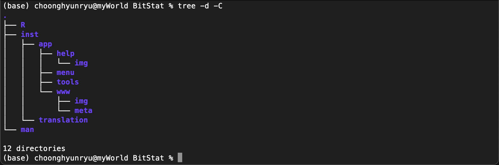
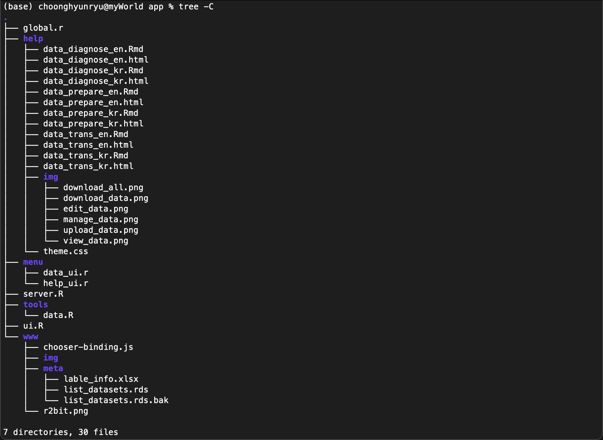

```{r setup, include=FALSE, echo=FALSE}
knitr::opts_chunk$set(echo = FALSE)

library(shiny)
library(htmltools)
```

```{r help, echo=FALSE, out.width = "50%", fig.align='center'}
knitr::include_graphics("img/help.png")
```

```{r, preface, echo=FALSE}
div(class = "preface", 
    h4("들어가기"),
    "BitStat의 도움말을 작성하기 위해서 사전 학습으로 R 마크다운 전반을 이해했습니다.", br(),
    "이제 이 챕터를 마치면, 여러분은 BitStat 도움말 개발자로 거듭나게 됩니다.", br(),
    "어렵지 않습니다. 하나씩 따라오면 됩니다.")
```

```{r, sol-1, echo=FALSE}
div(class = "bg-orange", style = "margin-right: 5px; padding-top: 10px; margin-top: 15px;",
    h3(icon("info-circle"), 
       "솔루션", style = "margin-bottom: 10px; margin-top: 0px;"), 
    "아직 R 마크다운에 익숙하지 않다면, 'R Markdown의 이해'와 'R Markdown hands-on'을 숙지한 후 도움말을 작성하시기 바랍니다.")
```

## BitStat 도움말 매커니즘

BitStat 도움말 매커니즘은, 미리 만들어 놓은 정적 HTML 파일을 Shiny 앱에 넣는 방법을 사용합니다. 
그래서 우리는 이미 앞의 R Markdown 핸즈온에서 웹 문서를 생성하는 방법을 익혔습니다.

### 패키지의 구조

현재 BitStat는 개발 버전으로 0.5.0.9001 버전 번호를 달고 있습니다. 개발 버전인 관계로 CRAN에 등록되어 있지 않고, 아래 github에만 등록되어 있습니다.

BitStat 패키지의 구조는 다음과 같습니다. Shiny 앱을 패키지로 빌드할 경우에는 ./inst 디렉토리 내에 앱을 위치시킵니다.



./inst 디렉토리 아래의 디렉토리 용도는 다음과 같습니다.

* app : Shiny 앱 디렉토리
    + help : 도움말 경로
        + img : 도움말 삽입 이미지 경로
    + menu : 메뉴별 UI/Server 로직 경로
    + tools : UI/Server를 지원하는 함수 경로
    + www : 웹 관련 경로 (Reserved, Not used)
        + img : 웹 이미지 경로
        + meta : 웹 메타 경로
* translation : 메뉴/메시지 i18n 지원 메타 파일 경로

### 도움말 상세 구조

도움말의 구조를 살펴 보기 위해서 파일 레벨까지 구조를 확장해 보겠습니다. app 디렉토리 이하의 경로에 생성된 파일입니다. (2021-10-26 기준)



도움말 화면을 개발할 소스 리소스들은 다음의 경로에 위치해 있습니다.

* 도움말 경로 : BitStat > inst > app > help
    + 도움말 파일이 위치한 경로
* 도움말 랜더링 소스 경로 : BitStat > inst > app > menu
    + 도움말 파일을 랜더링하는 help_ui.R 파일이 위치


## 도움말 개발하기

RStudio 환경에서 도움말을 개발하는것을 전제로 설명합니다.

BitStat 패키지는 RStudio 프로젝트로 배포되며, 프로젝트를 열면 다음과 같은 형태가 될 것입니다.


### 도움말 문서 이해하기

도움말 문서는 R 마크다운으로 만듭니다. R 마크다운 파일은 inst > app > help 경로에 위치합니다. 

도움말 파일 경로에는 어떤 파일이 있을까요?

inst > app > menu 경로로 이동하면 여러 개의 파일을 발견할 수 있습니다.


다국어를 지원 (i18n)하는 BitStat는 현재 한글과 영문 도움말을 지원합니다. 그리고 이들은 파일 이름의 접미어(postfix)로 구분합니다.

* 한글 도움말 파일
    + *_kr.Rmd : 한글 도움말 생성을 위한 R Markdown 문서 이름
        + 사례 : data_diagnose_kr.Rmd 
    + *_kr.html : 한글 도움말 파일 이름
        + 사례 : data_diagnose_kr.html    
* 영문 도움말 파일
    + *_en.Rmd : 영문 도움말 생성을 위한 R Markdown 문서 이름
        + 사례 : data_diagnose_en.Rmd     
    + *_en.html : 영문 도움말 파일 이름   
        + 사례 : data_diagnose_en.html   

도움말에 사용하는 이미지 파일은 **img** 디렉토리에 보관합니다.
**theme.css**는 도움말 문서의 테마를 정의한 CSS 파일입니다.

### 도움말 문서 파일 만들기
여러분은 이제 R 마크다운 문서로 도움말을 작성한 후, HTML 파일을 빌드해야 합니다.

다음은 도움말을 작성하기 위한 R 마크다운 파일의 예시입니다.


현재 도움말 파일 경로에 있는 R 마크다운 중에서 도움말을 작성해야 할 대상은 다음과 같습니다.

* 기 개발한 도움말 문서 (1종)
    + 데이터 준비 국문
        + data_prepare_kr.Rmd
* 신규로 개발해야할 도움말 문서 (5종)
    + 데이터 준비 영문
        + data_prepare_en.Rmd
    + 데이터 진단 국문
        + data_diagnose_kr.Rmd
    + 데이터 진단 영문
        + data_diagnose_en.Rmd
    + 데이터 변환 국문
        + data_trans_kr.Rmd
    + 데이터 변환 영문
        + data_trans_en.Rmd

신규로 개발해야할 도움말은 템플릿 수준으로 이미 파일을 만들어 두었습니다.


**자, 이제 여러분은 맡은 도움말 템플리트를 채워서 문서를 완성하면 됩니다.**


### 도움말 문서 빌드하기

이미 만들어진 **데이터 준비 국문** 도움말을 기준으로 설명합니다.

R 마크다운 파일인 data_diagnose_kr.Rmd을 열고 **knit** 메뉴버튼을 눌러 최종 도움말 파일 형식인 HTML 파일을 생성합니다.
도움말을 작성할 여러분이 생성한 R 마크다운을 사용해야하는 것은 당연하겠지요.


빌드가 정상적으로 수행되면 다음과 같은 HTML 도움말 파일이 생성됩니다.


## 에필로그

### 도움말 연결하기

BitStat 메뉴에서 **도움말** 메뉴를 선택하면, 다음 삽화처럼 도움말 화면이 출력됩니다.


여러분이 생성한 도움말 파일인 *.html이 어떻게 BitStat안에서 랜더링될까요?

앞에서 언급한, **도움말 파일을 랜더링하는 help_ui.R 파일**이 이 역할을 수행합니다.

다음 R 코드가 **데이터 준비 도움말** 파일인 'data_prepare_kr.html'과 'data_prepare_en.html'을 도움말 메뉴와 연결해서, 도움말을 선택 시 도움말을 화면에 랜더링하게 도와줍니다.  

이미 여러분이 작성해야할 대상 도움말에 대해서 코딩해 놓았기에, 여러분은 이런 매커니즘으로 도움말이 구현된다는 선에서 참고하시기 바랍니다. 

```{r, eval=FALSE, echo=TRUE}
addResourcePath("tmpuser", getwd())

help_language <- reactive({
  get("language", envir = .BitStatEnv)
}) 

output$data_prepare <- renderUI({
  tags$iframe(
    seamless = "seamless",
    src = glue::glue("tmpuser/help/data_prepare_{help_language()}.html"),
    width = "100%",
    height = "100%"
  )
})
```

### 감사인사

여러분의 오픈소스 기여에 감사드립니다.

이제 여러분이 작업한 도움말이 BitStat 사용자에게 유용한 등불이 될 것입니다.


