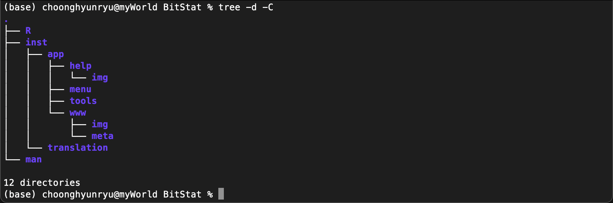
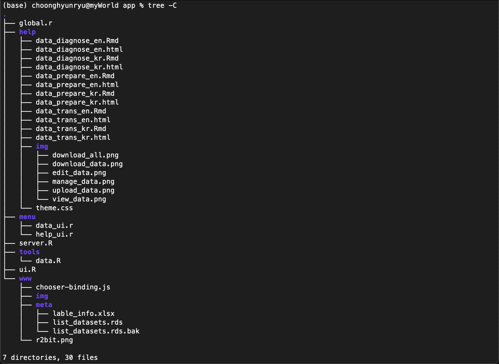
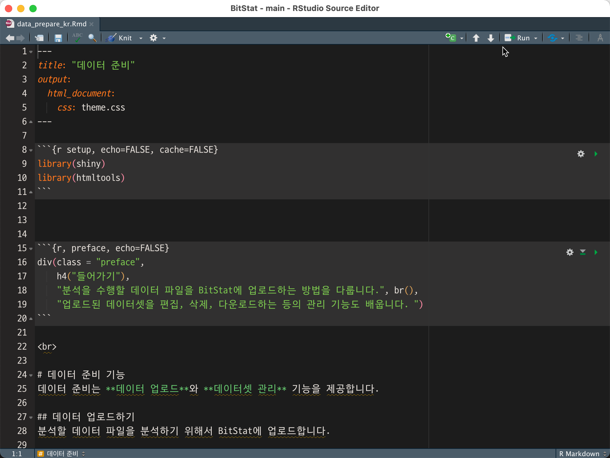

```{r setup, include=FALSE}
knitr::opts_chunk$set(echo = FALSE)
```

## BitStat 도움말 매커니즘

BitStat 도움말 매커니즘은, 미리 만들어 놓은 정적 HTML 파일을 Shiny 앱에 넣는 방법을 사용합니다. 
그래서 우리는 이미 앞의 R Markdown 핸즈온에서 웹 문서를 생성하는 방법을 익혔습니다.

### BitStat 패키지의 구조

BitStat 패키지의 구조는 다음과 같습니다. Shiny 앱을 패키지로 빌드할 경우에는 ./inst 디렉토리 내에 앱을 위치시킵니다.



./inst 디렉토리 아래의 디렉토리 용도는 다음과 같습니다.

* app : Shiny 앱 디렉토리
    + help : 도움말 경로
        + img : 도움말 삽입 이미지 경로
    + menu : 메뉴별 UI/Server 로직 경로
    + tools : UI/Server를 지원하는 함수 경로
    + www : 웹 관련 경로 (Reserved, Not used)
        + img : 웹 이미지 경로
        + meta : 웹 메타 경로
* translation : 메뉴/메시지 i18n 지원 메타 파일 경로

### BitStat 패키지의 도움말 상세 구조

도움말의 구조를 살펴 보기 위해서 파일 레벨까지 구조를 확장해 보겠습니다. app 디렉토리 이하의 경로에 생성된 파일입니다. (2021-10-26 기준)



여기서 도움말과 관련된 경로는 help와 menu 디렉토리입니다. help 디렉토리에는 도움말 파일이 위치해 있습니다. 그리고 menu 디렉토리는 도움말 파일을 핸들링하는 help_ui.R 파일이 위치합니다.

## 도움말 파일 
도움말 파일은 R Markdown으로 만듭니다. 파일은 inst > app > help 경로에 보관하고 HTML 파일로 빌드합니다.

### 다국어 지원 (i18n)

현재 BitStat는 한글과 영문 도움말을 지원합니다. 그리고 이들은 파일 이름의 접미어(postfix)로 구분합니다.

* 한글 도움말 파일
    + *_kr.Rmd : 한글 도움말 생성을 위한 R Markdown 문서 이름
        + 사례 : data_diagnose_kr.Rmd 
    + *_kr.html : 한글 도움말 파일 이름
        + 사례 : data_diagnose_kr.html    
* 영문 도움말 파일
    + *_en.Rmd : 영문 도움말 생성을 위한 R Markdown 문서 이름
        + 사례 : data_diagnose_en.Rmd     
    + *_en.html : 영문 도움말 파일 이름   
        + 사례 : data_diagnose_en.html   

### 도움말 파일 만들기
도움말을 위한 R Markdown 파일을 만든 후, 해당 경로에 HTML 파일을 빌드합니다.

다음은 도움말을 작성하기 위한 R Markdown 파일의 예시입니다.



