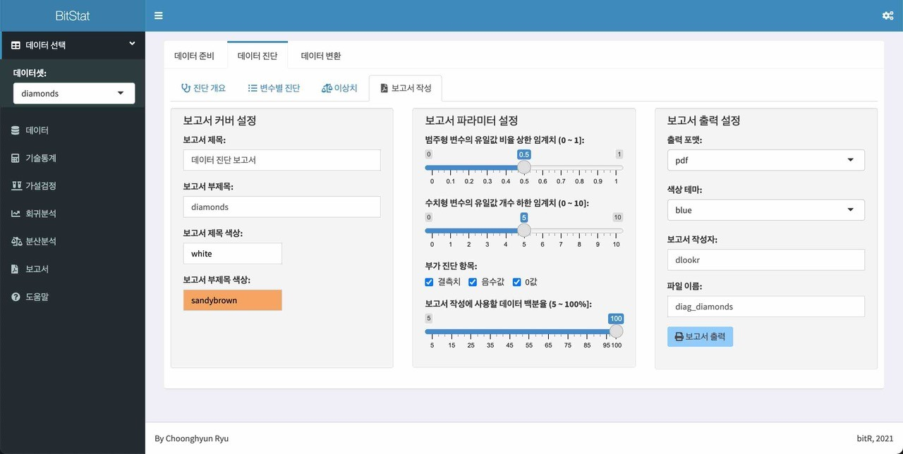

```{r setup, include=FALSE}
knitr::opts_chunk$set(echo = FALSE)
```

## 다국어 지원 (i18n)

BitStat은 메뉴와 메시지 등 UI 레벨에서 한글과 영문을 지원합니다. 




## 도움말 기능

BitStat은 제공하는 모든 기능에 대해서 도움말을 제공하고 있습니다.
도움말도 다국어를 지원하기 때문에 사용자의 환경에 따라서 한글과 영문으로 제공합니다.

